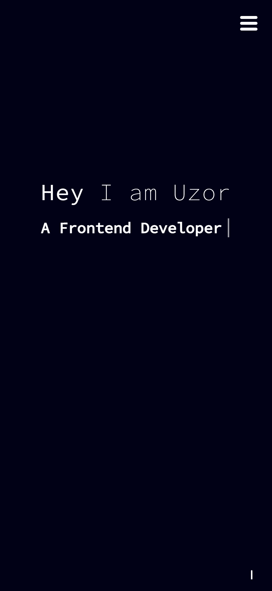
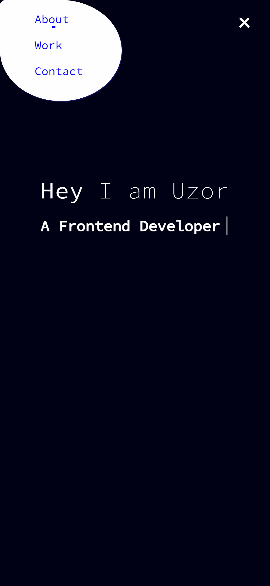

# Frontend Mentor - Personal Portfolio Webpage

## Objective:

To build an app that is functionally similar to [this](https://codepen.io/freeCodeCamp/full/zNBOYG)

## Table of contents

- [Overview](#overview)
  - [The challenge](#the-challenge)
  - [Screenshot](#screenshot)
  - [Links](#links)
- [My process](#my-process)
  - [Built with](#built-with)
  - [What I learned](#what-i-learned)
  - [Continued development](#continued-development)
  - [Useful resources](#useful-resources)
- [Author](#author)
- [Acknowledgments](#acknowledgments)

## Overview

### The challenge

Fulfill the below user stories and get all of the tests to pass. Give it your own personal style.
You can use HTML, JavaScript, and CSS to complete this project. Plain CSS is recommended
because that is what the lessons have covered so far and you should get some practice with plain
CSS. You can use Bootstrap or SASS if you choose. Additional technologies (just for example
jQuery, React, Angular, or Vue) are not recommended for this project, and using them is at your
own risk. Other projects will give you a chance to work with different technology stacks like
React. We will accept and try to fix all issue reports that use the suggested technology stack for
this project. Happy coding!

1. User Story #1: My portfolio should have a welcome section with an id of welcome-section.
2. User Story #2: The welcome section should have an h1 element that contains text.
3. User Story #3: My portfolio should have a projects section with an id of projects.
4. User Story #4: The projects section should contain at least one element with a class of
5. project-tile to hold a project.
6. User Story #5: The projects section should contain at least one link to a project.
7. User Story #6: My portfolio should have a navbar with an id of navbar.
8. User Story #7: The navbar should contain at least one link that I can click on to navigate to
9. different sections of the page.
10. User Story #8: My portfolio should have a link with an id of profile-link, which opens my
11. GitHub or FCC profile in a new tab.
12. User Story #9: My portfolio should have at least one media query.
13. User Story #10: The height of the welcome section should be equal to the height of the viewport.
14. User Story #11: The navbar should always be at the top of the viewport.

### Screenshot

#### Mobile Home Page

#### Mobile Menu Active

### Links

- Solution URL: [GitHub](https://github.com/mikechibuzor/fake-portfolio)
- Live Site URL: [See how it turned out](https://fake-portfolio-one.vercel.app/)

## My process

### Built with

- Semantic HTML5 markup
- CSS custom properties
- Flexbox
- CSS Grid
- Desktop First Workflow

### What I learned

- CSS neumorphism
- Typewriter effect with pure CSS

### Useful resources

- : @interfacely, helped me with some design inspiration [lapa.ninja](https://lapa.ninja)

## Author

- Website - [Chibuzor](https://github.com/mikechibuzor)

## Acknowledgments

- Segun Mustafa: For creating an awesome community

- To everyone in the segsalerty community, for helping me get better with each review, helping me pay more attention to details, helping me see the need for a proper documentation (this is the very start, explains why it might not be all that great), among other things
